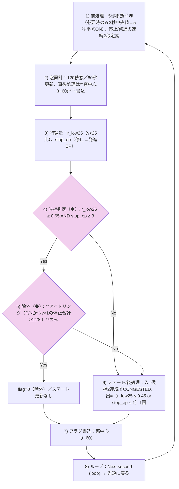

```mermaid
flowchart TD
  %% 1) 前処理
  A["1) 前処理：5秒移動平均（必要時のみ3秒中央値→5秒平均ON）、停止/発進の連続2秒定義"]
  B["2) 窓設計：120秒窓／60秒更新、事後処理は**窓中心(t−60)**へ書込"]
  C["3) 特徴量：r_low25（v&lt;25比）、stop_ep（停止→発進EP）"]
  D{"4) 候補判定（◆）：r_low25 ≥ 0.65 AND stop_ep ≥ 3"}

  %% 5) 除外（◆）：アイドリングのみ
  E{"5) 除外（◆）：**アイドリング（P/Nかつv&lt;1の停止合計≥120s）**のみ"}
  X["flag=0（除外）／ステート更新なし"]
  S["6) ステート/後処理：入=候補2連続でCONGESTED、出=（r_low25 ≤ 0.45 or stop_ep ≤ 1）1回"]
  W["7) フラグ書込：窓中心（t−60）"]
  L["8) ループ：Next second (loop) → 先頭に戻る"]
  A --> B --> C --> D
  D -- "No" --> S
  D -- "Yes" --> E
  E -- "Yes" --> X --> W
  E -- "No"  --> S
  S --> W --> L --> A
  style D fill:#F2CFEE;
  style E fill:#F2CFEE;
  classDef width padding:30px;
  class A,B,C width;
```

